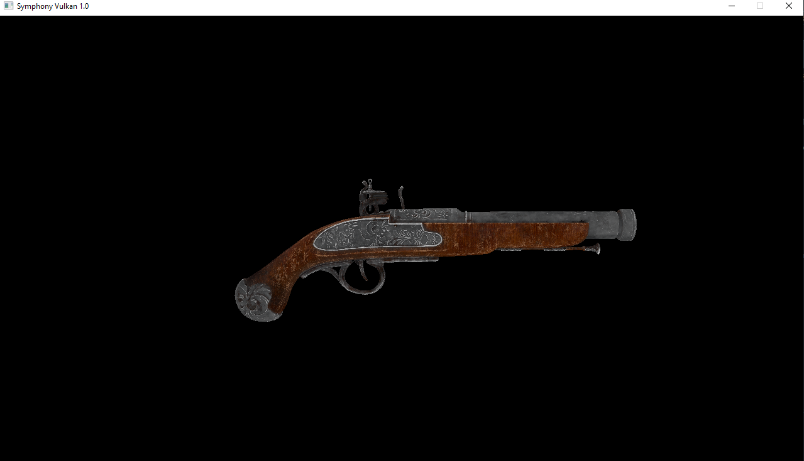

# Symphony : yet another open source personal game engine

(Temporary logo, that old png doesn't fit what I want Symphony to look like)

Symphony is a new born open source game engine, first created on March 2 2021.
Its goal is to provide a fully cross-platform renderer module, an audio system, physics and other core features such as input.

## This game engine stopped development in April 2021.

## Current stuff it can do

- Fully cross platform backend (Vulkan, OpenGL, DirectX 11, DirectX 12)
- Window abstraction with SDL2
- Plugin loading with Win32 DLLs
- GLSL, SPIRV and HLSL shaders (Vertex shaders and Pixel Shaders, no geometry shader for now)
- File loading, Image loading and 3D Mesh loading

## Screenshots

### 3D Model from file, Vulkan backend

## Stuff I want to implement

- Metal backend
- Deko3D backend for future Nintendo Switch support
- Input
- Audio
- Networking
- Physics
- Multithreading
- Entity Component System and Scene system
